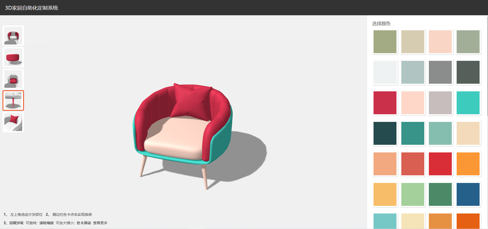
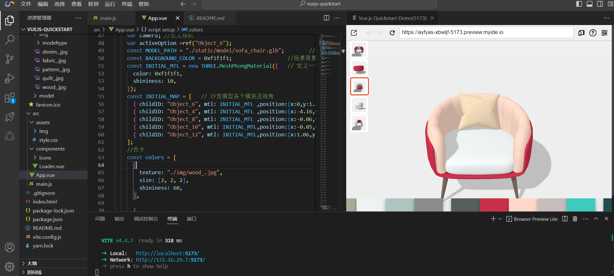

# 使用Cloud Studio迅捷开发一个3D家具个性化定制应用
本项目使用Cloud Studio开发了一个3D家具个性化定制应用，包含以下功能：三维场景创建，沙发模型导入，沙发模型3D展示，场景中光影效果构建， 沙发零部件实现切换材质颜色，视角切换动画等等。
消费升级时代，个性化定制商品成为大趋势，运用3D技术、可视化定制技术、VR/AR技术，为企业提供“互联网+个性化定制服务”的软件系统，可以帮助企业快速开展线上3D可视化定制业务。





## 技术栈

vue3：JavaScript 框架     
Three.js：JavaScript 3D图形引擎库，其库提供的特性与API以绘制3D场景于浏览器。

## 项目技术博客介绍地址

请看 [【腾讯云Cloud Studio实战训练营】使用Cloud Studio迅捷开发一个3D家具个性化定制应用](https://blog.csdn.net/m0_61243965/article/details/131997078).

## 项目使用方法

### 项目依赖下载

```sh
npm install
```

### 项目运行

```sh
npm run dev
```

### 项目打包

```sh
npm run build
```
### 项目操作指南

<p><strong>1、</strong> 左上角选定沙发部位 &nbsp;</p>
<p><strong> 2、</strong> 侧边栏色卡点击实现换装 </p>
<p><strong>3、拾取沙发&nbsp;</strong> 可旋转;
            <strong>&nbsp;滚轮缩放&nbsp;</strong> 可放大缩小;
            <strong>&nbsp;色卡滑动&nbsp;</strong> 查看更多</p>


### 项目来源
本项目来源于[《腾讯云 Cloud Studio 实战训练营》](https://marketing.csdn.net/p/06a21ca7f4a1843512fa8f8c40a16635)的参赛作品，该作品在腾讯云 [Cloud Studio](https://www.cloudstudio.net/?utm=csdn) 中运行无误。


### 贡献

如果您对该项目有任何改进意见或功能建议，欢迎提交 Issue 或 Pull Request。